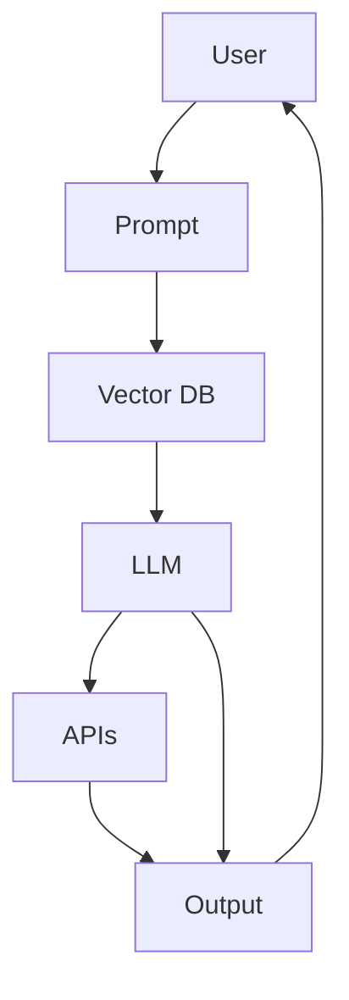

# 🤖AI KnowledgeMate

> *An intelligent AI-powered assistant that reads, remembers, and reasons — turning raw data into actionable insights.*

---

## 🚀 Overview

The **AI KnowledgeMate** is a next-generation personal research agent designed for students, researchers, and professionals.  

It combines **Large Language Models (LLMs), Vector Databases, and Advanced Prompt Engineering** to provide:

- Instant answers from your documents and notes
- Research comparisons from live sources (Wikipedia, arXiv, Google, etc.)
- Smart summaries, quizzes, and structured reports

---

## ✨ Key Features

- 📂 **Document Ingestion** – Upload PDFs/notes stored as embeddings in a vector DB
- 🔍 **Intelligent Search** – Semantic retrieval using cosine/dot/Euclidean similarity
- 🧠 **Advanced Prompting** – Zero/One/Few-shot, Chain-of-Thought, Dynamic Templates
- 🔗 **Function Calling** – Integrates APIs (Wikipedia, Google, arXiv) for real-time research
- 📝 **Output Flexibility** – Summaries, JSON outputs, structured tables, quizzes, reports
- 🎛 **Fine Control** – Adjust temperature, Top-K, Top-P, stop sequences
- 📊 **Monitoring** – Token usage tracking, evaluation dataset, cost logs

---

## 🏗️ Architecture

---

## 🛠️ Tech Stack

- **Backend**: Node.js + Express
- **Database**: Pinecone / Weaviate / FAISS
- **LLM Models**: OpenAI GPT / LLaMA / Local LLMs
- **Embeddings**: OpenAI text-embedding-ada-002 / Sentence Transformers
- **APIs**: Wikipedia, arXiv, Google Search
- **UI** (optional): React / Next.js

---

## ⚡ Example Use Cases

### Summarization
*"Summarize this 20-page research paper into 200 words with key takeaways."*

### Comparison
*"Compare the 3 most recent arXiv papers on Generative AI in a structured table."*

### Quiz Generator
*"Generate 10 MCQs with answers from this PDF."*

---

## 🚧 Roadmap

- 🔄 Multi-Agent Debate Mode
- 🧾 Long-Term Memory Knowledge Graph
- 📂 Google Drive / Notion Integration
- 🎙️ Voice Interaction

---

## 📜 License

MIT License © 2025 – Open for community contribution

---

## 🤝 Contributing

We welcome contributions! Please feel free to submit a Pull Request.

## 📞 Support

If you have any questions or need support, please open an issue on GitHub.

Zero-Shot Prompting :
        Summarize this research paper in 5 key points.

One-Shot Prompting :
        Example: 
            Input: "Explain Quantum Computing in simple terms."
            Output: "Quantum computing uses qubits that can represent 0 and 1 simultaneously, allowing faster problem-solving."

            Now, Input: "Explain Generative AI in simple terms."

Multi-Shot Prompting  :
        Example 1:  
            Input: "Summarize: 'AI can help doctors detect diseases early.'"  
            Output: "AI enables early disease detection."

        Example 2:  
            Input: "Summarize: 'Renewable energy reduces pollution and saves costs.'"  
            Output: "Renewables cut pollution and save money."

        Now, Input: "Summarize: 'Generative AI creates new content like images, text, and music.'"

Chain-of-Thought Prompting (CoT) :
        You are AI KnowledgeMate, a research assistant. 
        Question: "What are the main contributions of the latest research on Generative AI?"  

        Steps to follow:  
        1. Break the question into smaller parts.  
        2. Reason step by step.  
        3. Summarize the reasoning.  
        4. Finally, give the answer in 2–3 sentences.
