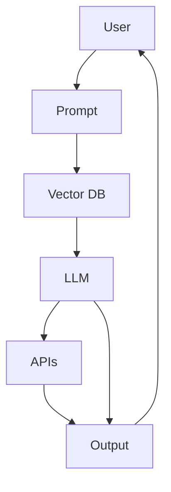

# 🤖AI KnowledgeMate

> *An intelligent AI-powered assistant that reads, remembers, and reasons — turning raw data into actionable insights.*

---

## 🚀 Overview

The **AI KnowledgeMate** is a next-generation personal research agent designed for students, researchers, and professionals.  
It combines **Large Language Models (LLMs), Vector Databases, and Advanced Prompt Engineering** to provide:
- Instant answers from your documents and notes
- Research comparisons from live sources (Wikipedia, arXiv, Google, etc.)
- Smart summaries, quizzes, and structured reports

---

## ✨ Key Features

- 📂 **Document Ingestion** – Upload PDFs/notes stored as embeddings in a vector DB
- 🔍 **Intelligent Search** – Semantic retrieval using cosine/dot/Euclidean similarity
- 🧠 **Advanced Prompting** – Zero/One/Few-shot, Chain-of-Thought, Dynamic Templates
- 🔗 **Function Calling** – Integrates APIs (Wikipedia, Google, arXiv) for real-time research
- 📝 **Output Flexibility** – Summaries, JSON outputs, structured tables, quizzes, reports
- 🎛 **Fine Control** – Adjust temperature, Top-K, Top-P, stop sequences
- 📊 **Monitoring** – Token usage tracking, evaluation dataset, cost logs

---

## 🏗️ Architecture

---

## 🛠️ Tech Stack

- **Backend**: Node.js + Express
- **Database**: Pinecone / Weaviate / FAISS
- **LLM Models**: OpenAI GPT / LLaMA / Local LLMs
- **Embeddings**: OpenAI text-embedding-ada-002 / Sentence Transformers
- **APIs**: Wikipedia, arXiv, Google Search
- **UI** (optional): React / Next.js

---

## ⚡ Example Use Cases

### Summarization
*"Summarize this 20-page research paper into 200 words with key takeaways."*

### Comparison
*"Compare the 3 most recent arXiv papers on Generative AI in a structured table."*

### Quiz Generator
*"Generate 10 MCQs with answers from this PDF."*

---

## 🚧 Roadmap

- 🔄 Multi-Agent Debate Mode
- 🧾 Long-Term Memory Knowledge Graph
- 📂 Google Drive / Notion Integration
- 🎙️ Voice Interaction

---

## 📜 License

MIT License © 2025 – Open for community contribution

---

## 🤝 Contributing

We welcome contributions! Please feel free to submit a Pull Request.

## 📞 Support

If you have any questions or need support, please open an issue on GitHub.
